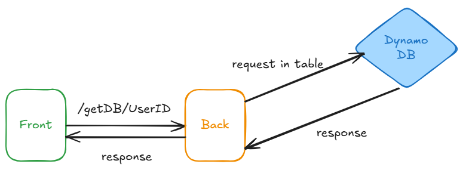

# Dummy Front/Back for DynamoDB 

## Local tests requirements
- node
- aws cli
- a dynamoDB with data like:
    ```json
    {
    "UserID": "1",
    "Name": "John Doe",
    "Age": 30
    }
    ```
## Worflow



## Components

### Front
- you need to replace line 75 of index.html when deployed somewhere.

### Back
- you need to ensure that your runtime have valid aws creds.
- replace line 9 and 23 with your values (map then with env vars from a lambda)
- npm install && npm run build -> build & zip app